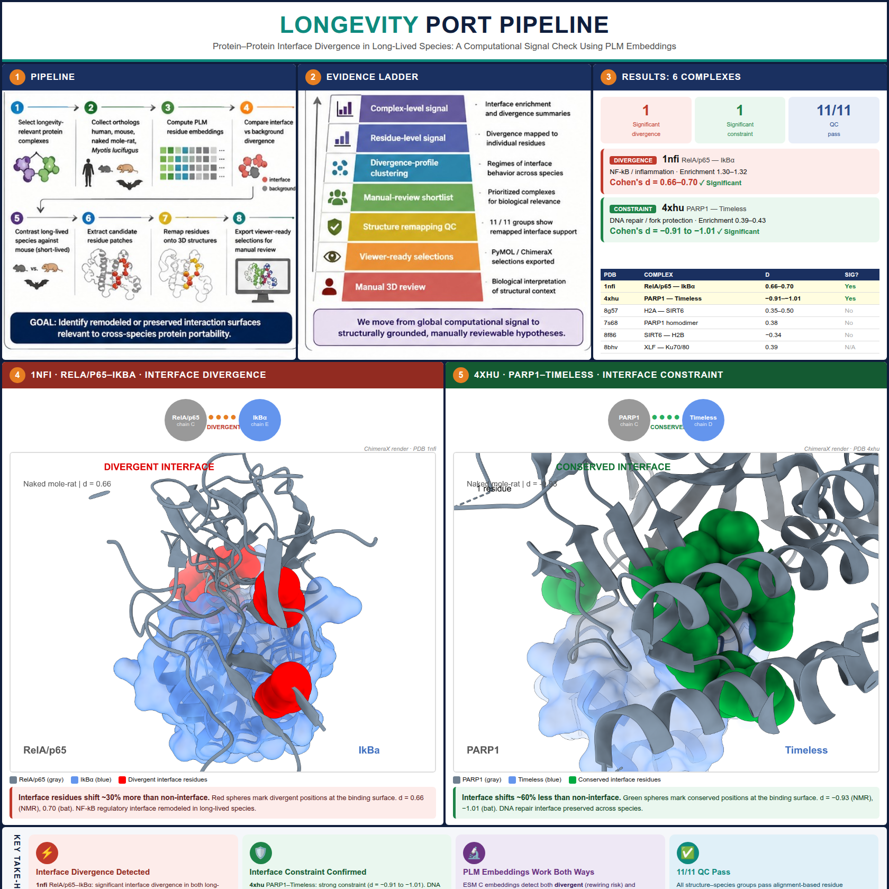
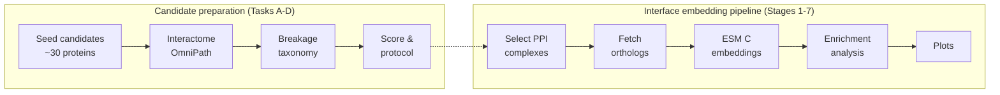

# LongevityPort — cross-species protein interaction analysis



> **Prototype status.** This is a preliminary computational signal check — built in ~1 week
> to see whether protein interface divergence in long-lived species is detectable before
> committing to a full proposal (Biswas Family Foundation Fast Grants, $50K AI + health).
> The code produces results, but the analysis has known limitations (see
> [Pilot results & roadmap](docs/PILOT_RESULTS.md)). Treat the outputs as promising
> preliminary data, not validated biological claims.

## The big picture

Some species live extraordinarily long: naked mole-rats (~31 yr), bowhead whales (~211 yr),
and certain bats (~41 yr). One hypothesis is that their **protein-protein interactions**
have diverged — key interactions are maintained, broken, or rewired compared to short-lived
species (mouse ~3 yr, human ~80 yr).

The central question is fine-grained: not just *"is the long-lived-species protein different
from the human one?"* but *does the ortholog differ especially strongly at the amino acids
that participate in interaction with its partner?* If the changes concentrate at the
interface, this may indicate altered binding specificity, remodeling of the complex, or
preservation of a critical surface — exactly what we need to judge whether a variant is
portable.

This repo tackles two complementary questions:
1. **Which proteins should we investigate?** — candidate & interactome analysis (Tasks A-D, no GPU)
2. **Do protein interfaces actually diverge?** — embedding signal check (Stages 1-7, Biohub API)



**Tasks A-D** run on a laptop (no GPU, no API keys): curate longevity proteins, map their
interactome from OmniPath, flag hub proteins, score on 10 wet-lab feasibility criteria, and
generate a breakage taxonomy for human curation.

**Stages 1-7** test the interface divergence hypothesis: take a known complex with a solved
3D structure, embed each chain with ESM C (via the remote Biohub ESMC service), swap one chain for the
ortholog from a long-lived species, re-embed, and check whether the embedding shift
concentrates at interface residues. The deliverable is an enrichment table + plots with
two negative controls (shuffled mask + NEGATOME).

## Prerequisites

You need **two things**:

1. **Python 3.13+** — check with `python3 --version`
2. **uv** — a fast Python package manager (replaces pip/conda/virtualenv):
   ```bash
   curl -LsSf https://astral.sh/uv/install.sh | sh
   ```

That's it. No conda environments, no Docker, no system-level packages.

## Setup (2 minutes)

```bash
# Clone the repo
git clone https://github.com/longevity-genie/longevity-port-pipelines.git
cd longevity-port-pipelines

# Install all dependencies into a local .venv (automatic, no activation needed)
uv sync
```

> **What is `uv run`?** It runs a command inside the project's virtual environment without
> you having to activate it. Think of it as `conda run` but instant. Every command in this
> README uses `uv run <name>`.

---

## Candidate preparation (Tasks A-D)

Run these in order. Each command writes CSV/parquet files to `data/output/`.

### Step 1 — Generate candidate protein list

```bash
uv run candidates
```

**What it does:** Writes a curated list of 32 longevity-relevant human proteins across 8
functional categories to `data/output/candidates.csv`.

**What you get:**

```
gene_name  uniprot_id  category                     description
SIRT1      Q96EB6      pro-longevity                NAD-dependent deacetylase, master metabolic sensor
TP53       P04637      dna-repair                   Tumor suppressor, genome guardian
HAS2       Q92819      ecm/hyaluronan               Hyaluronan synthase 2, NMR high-MW-HA producer
CIRBP      Q14011      stress-response/cold-shock   Cold-inducible RNA-binding protein
CGAS       Q8N884      inflammation/cGAS-STING      Cyclic GMP-AMP synthase, cytosolic DNA sensor
...        ...         ...                          ...
```

**Categories:** pro-longevity (7), DNA repair (5), inflammation/cGAS-STING (4),
proteostasis (4), mitochondrial stress (3), senescence (3), ECM/hyaluronan (3),
stress response/cold shock (3).

> **Want to add your own proteins?** Edit `src/longevity_port_pipelines/stages/candidates.py`
> and add a `CandidateProtein(...)` entry. You need the gene name and UniProt ID
> (look it up at [uniprot.org](https://www.uniprot.org/)).

### Step 2 — Fetch interactome data

```bash
uv run interactome
```

**What it does:** Queries [OmniPath](https://omnipathdb.org/) — a meta-database that
aggregates STRING, BioGRID, IntAct, Reactome, SIGNOR, and 100+ other sources — for every
candidate protein in one bulk API call. Then fetches UniProt annotations (molecular weight,
subcellular location, glycosylation) for each protein.

**What you get (2 files):**

`data/output/interactome.csv` — one row per candidate:

```
gene_name  n_partners  is_hub  databases                           top_partners
SIRT1      248         true    BioGRID, IntAct, SIGNOR, ...        FOXO3, TP53, NFE2L2, ...
CIRBP      18          true    OmniPath, SIGNOR, ...               RBM3, EIF4G1, ...
```

`data/output/interactome_partners.parquet` — full interaction list (one row per pair).

**Key concept — hub proteins:** Proteins with >15 interaction partners are flagged as
"hubs". Porting a hub protein across species risks destabilising its entire interaction
network (the "mTOR-like rewiring" problem). Hubs aren't excluded — they're just scored
lower in the validation step.

### Step 3 — Generate breakage taxonomy table

```bash
uv run breakage-table
```

**What it does:** Creates a table crossing each candidate protein with each target species,
listing known functional and regulatory/degradation partners.

**What you get:** `data/output/breakage_taxonomy.csv`

```
protein  species          functional_partners  regulatory_partners  desired_interaction_state
SIRT1    naked_mole_rat   FOXO3, TP53, ...     MDM2, UBE2I, ...     (fill in)
SIRT1    bowhead_whale    FOXO3, TP53, ...     MDM2, UBE2I, ...     (fill in)
HAS2     naked_mole_rat   CD44, RHAMM, ...                          (fill in)
```

**Your job:** Fill in the `desired_interaction_state` column with one of:
- `maintained` — this interaction should be preserved in the long-lived species
- `broken` — this interaction should be disrupted (e.g., pro-aging pathway)
- `rewired` — the interaction changes partners or strength

This is the biological hypothesis — the computational pipeline then tests it.

### Step 4 — Score candidates + generate protocol

```bash
uv run validation-protocol
```

**What it does:** Scores each candidate on 10 binary criteria and generates a prioritised
ranking plus SVG plots.

**Scoring criteria (10 points max):**

| # | Criterion | Why it matters |
|---|-----------|---------------|
| 1 | Has AlphaFold structure | Can we model it? |
| 2 | Has human ortholog | Always true (we start from human) |
| 3 | Has known interactors | Is there a network to analyse? |
| 4 | Not a hub (<=15 partners) | Hubs risk network-wide side effects |
| 5 | Assay-feasible (soluble, <80 kDa) | Can we test it in the lab? |
| 6 | Has breakage hypothesis | Did you fill in the breakage table? |
| 7 | Cell-free expressible | Works in Adaptyv's cell-free system? |
| 8 | Under 80 kDa | Size constraint for cell-free expression |
| 9 | Not membrane protein | Membrane proteins are hard to express |
| 10 | No glycosylation needed | Cell-free systems can't glycosylate |

**Priority tiers:** HIGH (8-10), MEDIUM (5-7), LOW (0-4)

**What you get (4 files):**

- `data/output/validation_scores.csv` — full scored table
- `data/output/validation_protocol.md` — formatted protocol document
- `data/output/plots/priority_scores.svg` — bar chart by priority tier
- `data/output/plots/hub_vs_score.svg` — scatter: partner count vs score
- `data/output/plots/category_breakdown.svg` — mean score per category

---

## Interface embedding pipeline (Stages 1-7)

After you have your prioritised candidates, this pipeline tests whether cross-species
sequence divergence concentrates at protein-protein interfaces.

**Embeddings use the remote Biohub ESMC service through the Biohub ESM SDK** — no local GPU or local model weights required.
Set your API token in `.env` (copy from `.env.template`).

```bash
uv run select              # Load PINDER PPI dataset, filter, annotate hubs
uv run orthologs           # Fetch orthologs for long-lived species
# >>> Review data/output/selection.csv and ortholog_coverage.csv <<<
uv run embed               # Per-residue embeddings via Biohub API
uv run analyze             # Enrichment analysis (interface vs non-interface)
uv run plot                # Summary plots
```

### Curated ortholog analysis ladder

For a manually curated candidate, use the smaller dry-run-first ladder instead of rerunning the full pipeline:

```bash
uv run curated-embedding-preflight
uv run curated-embedding-single
uv run curated-analysis-preflight
uv run curated-analysis-plan
uv run curated-analysis-runner
uv run curated-analysis-enrichment
```

`curated-analysis-enrichment` loads already-saved embeddings, extracts interface residues, and computes a technical interface-vs-noninterface enrichment checkpoint only when explicitly run with `--yes-run`. It does not call Biohub, does not call Boltz, and does not generate new embeddings.

Treat this output as a technical checkpoint, not validated biological evidence, until NEGATOME control is applied.

For the scoped MDM2 lane, the audited local-only runner is:

```bash
uv run tp53-mdm2-mapped-interface-enrichment             # input/mapping dry run
uv run tp53-mdm2-mapped-interface-enrichment --yes-run   # explicit local calculation
uv run tp53-mdm2-mapping-cutoff-alignment-sensitivity    # A2 dry run
```

It consumes exact externally bound sequences and existing ignored ESMC `.npy`
files. It translates the `1YCR:A` interface to full-length `Q00987`
coordinates, maps those positions to elephant, mouse, and hamster, and uses
same-size shuffled masks in the identical residue-level L2 enrichment metric
family. It makes no network or model call and writes no `data/output` artifact.

The committed three-row MDM2 result is Gate 8 input only. It is not a
long-lived-vs-short-lived contrast or disposition, does not apply the earlier
NEGATOME value across incompatible metric families, does not open Gate 9, and
supports no biological claim.

The A2 command binds the exact local `1YCR` structure, reconstructs the full
85-residue `1YCR:A -> Q00987` coordinate map, and enumerates all optimal traces
for five interface cutoffs and five alignment policies. Only an explicit
`--yes-run` computes the 485 metric-compatible scenarios. The committed A2
result is stable under the predeclared grid: all 485 ratios remain below 1,
all mappings are complete, and every shuffled lower-tail check passes. This
permits only the separate A3 leave-one-control-out and residue-block jackknife
step; it does not run Gate 8 disposition and does not open Gate 9. Exact
result ranges and claim boundaries are documented in
`docs/tp53_mdm2_mapping_cutoff_alignment_sensitivity_result.md`.

Or run all stages at once:

```bash
uv run run-pipeline                  # everything
uv run run-pipeline --pre-gpu-only   # stop after stage 4 (audit checkpoint)
```

## Pilot results

The v2 pilot (43 complexes, 13,415 residue-level deltas) produced a preliminary signal.
The strongest hit: **8bhv XLF/NHEJ1** (NHEJ DNA repair) shows enrichment ~2.59 in
naked mole-rat and ~2.34 in mouse — embedding divergence concentrated at the binding
surface. The method also distinguishes **interface-constrained** candidates (preserved
surface, safer to port) from **interface-divergent** ones (remodeled, higher risk).

Main limitations: missing NEGATOME negative controls, no long-lived vs short-lived
contrast yet. See [docs/PILOT_RESULTS.md](docs/PILOT_RESULTS.md) for the full table,
statistics, limitations, and roadmap.

---

## Validation closure

For the SIRT6 v2 core3-expanded controlled-evidence workflow, see:

```text
docs/core3_validation_closure.md
```

This document explains how curated NEGATOME-style controls feed the negative-control audit, candidate scorecard, validation plan, and final validation-closure summary.

## Data layout

```
data/
├── input/     IN GIT      — user-curated files (custom_candidates.csv)
├── interim/   GITIGNORED  — cached API responses (UniProt, PINDER, STRING, Foldseek)
└── output/    GITIGNORED  — pipeline outputs (CSVs, embeddings, enrichment, plots)
```

All `interim/` and `output/` files are regenerable by running the pipeline commands above.
Only `data/input/` is committed to git.

## Development

```bash
uv sync --group dev         # install dev dependencies
uv run ruff check src       # lint
uv run mypy src             # type check
uv run pytest               # tests
```

## Further reading

- [docs/PILOT_RESULTS.md](docs/PILOT_RESULTS.md) — pilot results, limitations, and roadmap
- [BUILD_BRIEF.md](BUILD_BRIEF.md) — the original design brief
- [docs/RESOURCES.md](docs/RESOURCES.md) — data source inventory with freshness checks
- [AGENTS.md](AGENTS.md) — conventions for AI-assisted development
